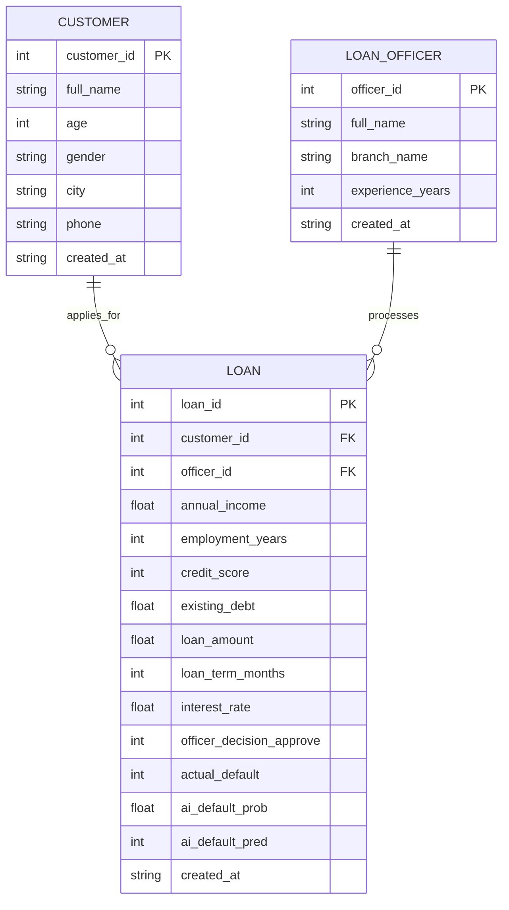

## ER Diagram (3 Entity Sets)

### Entity sets
- **Customer**
- **LoanOfficer**
- **Loan**

### Relationships
- **Customer (1) — (M) Loan**
  - A customer can have many loans/applications.
  - Each loan belongs to exactly one customer.
- **LoanOfficer (1) — (M) Loan**
  - A loan officer can handle many loans/applications.
  - Each loan is assigned to exactly one loan officer.

### Mermaid ER diagram (use in presentation)

### ML problem definition (Binary Classification)
- **Input (X)**: loan + customer financial features (income, credit score, debt, loan amount, etc.)
- **Output (y)**: `actual_default`  
  - 1 → loan defaulted  
  - 0 → loan did not default
- **Goal**: predict default risk for new loan applications, then store:
  - `ai_default_prob` (probability of default)
  - `ai_default_pred` (0/1 using a threshold)

